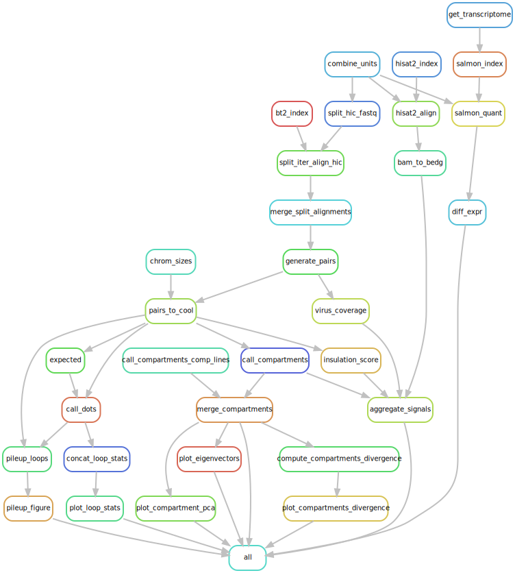

# human_hbv_cancer
Investigation of genomic abberations in cancerous HBV-infected liver cell lines using Hi-C.

### Dependencies
The following python packages must be installed to run the analysis:
* python >= 3.7
* snakemake
* GNU awk
* anaconda
* singularity

### Input files
The input files required for the analysis are a genome in fasta format and Hi-C libraries in pairs format:

Hepatocellular carcinoma (HCC) libraries generated in this project are processed from fastq files. Additionally, a number Hi-C dataset of healthy human tissues taken from [Schmitt et al. 2016](https://doi.org/10.1016/j.celrep.2016.10.061) are used for comparison. Those datasets are provided as preprocessed and stored in the input directory as `cool` files.


### Running the analysis
The analysis is written in python and use conda environments (or optionally, singularity containers) to manage dependencies. The analysis is centralized in a master `Snakefile` and the different parts of the analysis are written in modular workflows in the `rules` directory. Those workflows are called by the `Snakefile` when running the pipeline.

The snakefile reads a number of parameters from the file `config.yaml`, such as the path to the reference genome.
Samples metadata and path to fastq files are described in the files `samples.tsv` and `units.tsv`, respectively.


To run the snakefile on 8 CPUs, simply use:

```bash
snakemake -j 8 --use-conda
```

The workflow will run independently for each library, each run starting from the genome and a pairs file:




### Output files

Different 1D signals are computed from the pairs file:
* Read coverage
* Virus contacts
* Insulation score
* A/B compartments scores
These signals are then combined into a bedgraph file for each sample. Taking the example above, the output files should be named.
```
data
└──output
    ├── all_signals_lib1.bedgraph
    └── all_signals_lib2.bedgraph
```

Differential expression is computed between liver cancer cell lines with integrated HBV and those without HBV integration. The output files from differential expression analysis are stored in `data/output/rnaseq/diff_expr`. These include a number of figures and two tabular files:
* `integration_vs_control.tsv`: Contains the fold change, p-value and other statistics from the differential expression analysis for each gene.
* `integration_vs_control_counts.tsv`: Contains the detailed TPM from each gene, for each replicate.

Compartments are also extracted from Hi-C data and the Eigenvectors are stored in `data/output/compartments`. This folder also contains a file `compartment_divergence.tsv` which contain informations about compartment divergence between healthy cell lines from Schmitt et al and cancer HCC cell lines. This file contain a cluster separation score (CSS) column which provides a divergence metric of compartments between the two categories (see [Jones et al., 2012](https://www.doi.org/10.1038/nature10944)). Associated p-values and q-values are derived from permutation tests.

Loop calling results are stored in `data/output/loops` loops are called by pooling all cancer libraries together to obtain the union of all possible loop position. All libraries are then downsampled to the lowest coverage of all samples and the loop score is computed separately for each sample on all loop positions.

> TODO: TAD border detection, insertions analysis, pileups
